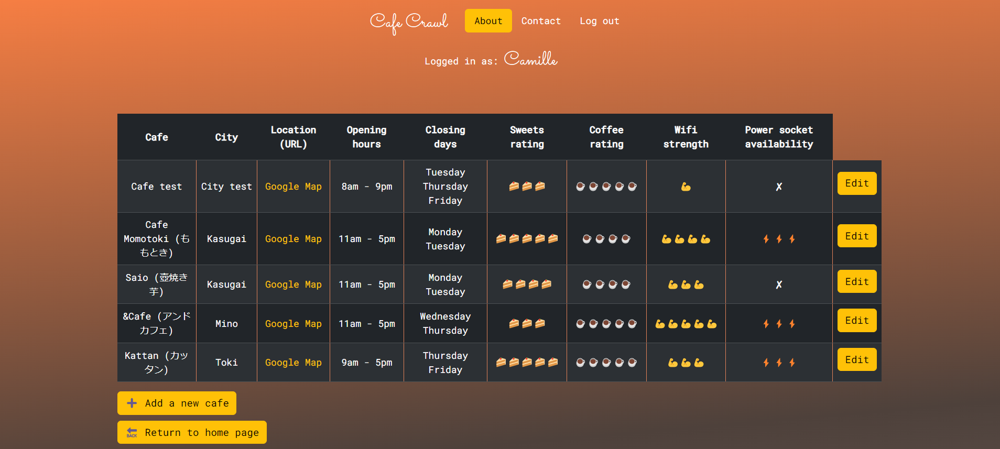

<!DOCTYPE html>
<html lang="en">

<head>
  <meta charset="UTF-8">
  <meta name="viewport" content="width=device-width, initial-scale=1.0">
</head>
<body>
<h1 style="text-align:center">Welcome!</h1>

Thank you for exploring my project! This app is born out of my love for road cycling and the joy of discovering cyclist-friendly cafes. I'm committed to maintaining and enhancing this app, making sure that it remains accessible to fellow cyclists eager to share their favorite cafes. Their feedback is invaluable, and I will continue improving usability and adding new features based on their suggestions.

<h2 style="text-align:center">☕️Coffee & Wifi 💻</h2>

This Python script implements a web application using the Flask framework
for managing information about cafes. The application allows users to view a
list of cafes, add new cafes, edit existing cafe details, and delete cafes
from the database.

<h2>Deployment</h2>
<a>https://coffeeandwifi-0a0e.onrender.com/</a>
<h2>Built with</h2>
<ul>
<li>Python</li>
<li>SQLalchemy</li>
<li>Flask</li>
<li>Bootstrap</li>
</ul>

<h2 style="text-align:center">Setup</h2>
<h2>Prerequisites</h2>
<ul>
<li>Python installed on your system.</li>
<li>Install required packages using the following command:</li>

</ul>
<h2>Running the Application</h2>
<ul>
<li>Clone or download the repository to your local machine.</li>
<li>Navigate to the project directory in your terminal.</li>

<li>Run the Flask application script.</li>

Make sure to replace script_name.py with the actual name of your Python script.

<li>Open a web browser and go to http://127.0.0.1:5000/ to access the application.</li>
</ul>
<h2 style="text-align:center">Application Features</h2>
<h2>Home page</h2>
<ul>
<li>Access the home page at /.</li>
<li>Dispays a description of the content.</li>
<li>Users can navigate to the 'About', 'Contact', 'Register' or 'Log in' pages.</li>
</ul>
<h2>Log in</h2>
<ul>
<li>Access the home page at /login.</li>
<li>Users can log in with their username and password.</li>
<li>If the username doesn't exist, users are prompted to register.</li>
</ul>
<h2>Register</h2>
<ul>
<li>Access the home page at /register.</li>
<li>Users can register by choosing a username and a password.</li>
<li>If the username doesn't exist, users are prompted to register.</li>
<li>Passwords are encrypted before storage and decrypted for log in.</li>
</ul>
<h2>Log out</h2>
<ul>
<li>Access the home page at /logout.</li>
<li>Users will be logged out and any cookies for their session will be cleaned up.</li>
</ul>
<h2>About</h2>
<ul>
<li>Access the about page at /about.</li>
<li>Dispays a picture with a description of the purpose of this app.</li>
<li>If users are logged in, they can navigate to the 'Contact'page and also log out. If they are not, they can access every pages: contact, log in, register.</li>
</ul>
<h2>Contact</h2>
<ul>
<li>Access the about page at /contact.</li>
<li>Dispays a basic contact form.</li>
<li>If users are logged in, they can navigate to the 'About' page and also log out. If they are not, they can access every pages: about, log in, register.</li>
</ul>
<h2>Cafe list page</h2>
<ul>
<li>Access the cafe list page at /cafes.</li>
<li>View that requires users to be logged in. The route is decorated with the login_required decorator.</li>
<li>Displays a list of cafes (ordered by city) stored in the database with all the information associated.</li>
</ul>
<h2>Add cafe page</h2>
<ul>
<li>Access the add cafe page at /add.</li>
<li>View that requires users to be logged in. The route is decorated with the login_required decorator.</li>
<li>Allows users to add a new cafe by providing necessary details through a form.</li>
</ul>
<h2>Edit cafe page</h2>
<ul>
<li>Access the edit cafe page at /edit.</li>
<li>View that requires users to be logged in. The route is decorated with the login_required decorator.</li>
<li>Edit the selected cafe details through a form. Information associated to the selected cafe are pre-filled in the form; updated information will be saved to the database and displayed at /cafes.</li>
</ul>
<h2>Delete cafe page</h2>
<ul>
<li>The /delete route is decorated with the login_required decorator and is only visible to the admin User.</li>
<li>If the cafe with the specified id is found, it is deleted from the database, and the admin is redirected to the updated list of all cafes.</li>
</ul>
<h2 style="text-align:center">Database</h2>
<ul>
<li>The database is set up to use SQLite, with the file name "coffee-wifi.db".</li>
<li>The application uses the Flask-SQLAlchemy extension to interact with the database.</li>
<li>The SECRET_KEY is generated either from the environment variable "SECRET_KEY" or using os.urandom(24).</li>
<li>It defines a model for a Cafe table and a User table.</li>
</ul>
<h2 style="text-align:center">Important Note</h2>
<ul>
<li>This application is configured to run in debug mode (app.run(debug=True)), which is suitable for development but should be disabled in a production environment.</li></ul> 

Feel free to explore and customize the application according to your needs. If you encounter any issues or have suggestions, please refer to the Flask documentation or open an issue in the repository.

<h2 style="text-align:center">Thank you!</h2>

Thank you to <a href="https://codepen.io/P1N2O/pen/pyBNzX">Manuel Pinto </a>for creating this beautiful gradient background used for the home page.

</body>
