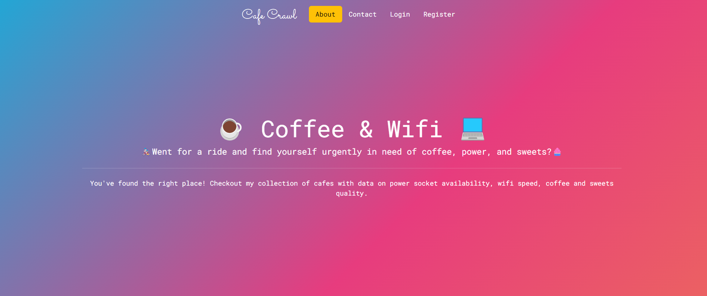

<!DOCTYPE html>
<html lang="en">

<head>
  <meta charset="UTF-8">
  <meta name="viewport" content="width=device-width, initial-scale=1.0">
</head>
<body>
<h1 style="text-align:center">Welcome!</h1>
<h2 style="text-align:center">☕️Coffee & Wifi 💻</h2>

This Python script implements a web application using the Flask framework
for managing information about cafes. The application allows users to view a
list of cafes, add new cafes, edit existing cafe details, and delete cafes
from the database.

<h2>How did I build this landing page?</h2>
<ul>
<li>Python</li>
<li>SQLalchemy</li>
<li>Flask</li>
<li>Bootstrap</li>
</ul>

<h2 style="text-align:center">Setup</h2>
<h2>Prerequisites</h2>
<ul>
<li>Python installed on your system.</li>
<li>Install required packages using the following command:</li>

</ul>
<h2>Running the Application</h2>
<ul>
<li>Clone or download the repository to your local machine.</li>
<li>Navigate to the project directory in your terminal.</li>

<li>Run the Flask application script.</li>

Make sure to replace script_name.py with the actual name of your Python script.

<li>Open a web browser and go to http://127.0.0.1:5000/ to access the application.</li>
</ul>
<h2 style="text-align:center">Application Features</h2>
<h2>Home page</h2>
<ul>
<li>Access the home page at /.</li>
<li>Displays a welcome message or introductory content.</li>
</ul>
<h2>Cafe list page</h2>
<ul>
<li>Access the cafe list page at /cafes.</li>
<li>Displays a list of cafes stored in the database.</li>
<li>Cafes are ordered by city.</li>
</ul>
<h2>Add cafe page</h2>
<ul>
<li>Access the add cafe page at /add.</li>
<li>Allows users to add a new cafe by providing necessary details through a form.</li>
<li>Removes the selected cafe from the database.</li>
</ul>
<h2>Edit cafe page</h2>
<ul>
<li>Access the edit cafe page at /edit.</li>
<li>Edit existing cafe details by providing the cafe ID and updating the necessary information through a form.</li>
<li>Updated information is stored in the database.</li>
</ul>
<h2 style="text-align:center">Database</h2>
<ul>
<li>The application uses SQLite as the database.</li>
<li>Database connection details and configurations are specified in the script.</li>
</ul>
<h2 style="text-align:center">Configuration</h2>
<ul>
<li>The application uses a secret key for session security.</li>
<li>The secret key is either obtained from an environment variable or generated using os.urandom.</li>
</ul>
<h2 style="text-align:center">Important Note</h2>
<ul>
<li>This application is configured to run in debug mode (app.run(debug=True)), which is suitable for development but should be disabled in a production environment.</li> 

Feel free to explore and customize the application according to your needs. If you encounter any issues or have suggestions, please refer to the Flask documentation or open an issue in the repository.

<h2 style="text-align:center">Thank you!</h2>

Thank you to <a href="https://codepen.io/P1N2O/pen/pyBNzX">Manuel Pinto </a>for creating this beautiful gradient background animation for the title and footer sections.

</body>
