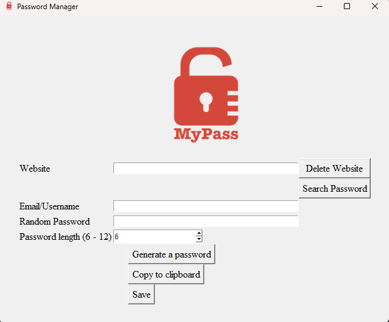

<!DOCTYPE html>
<html lang="en">
<head>
    <meta charset="UTF-8">
    <meta name="viewport" content="width=device-width, initial-scale=1.0">
</head>
<body>

    

        <h1 align="center">CrypticPass</h1>
        
    

    
This program is a simple password generator/manager with a graphical user
     interface (GUI) built using the Tkinter library in Python.
     
Users can manage multiple entries per website, each associated with a 
     unique email and an encrypted password. The program allows users to retrieve 
     passwords based on specific website and email combinations and also provides
      the option to delete information for a particular website and email address.

     <h3 align="center">Main features</h3>
        <ul>
            <li>External libraries:</li>
                <ul>
                    <li>cryptography</li>
                    <li>pyperclip</li>
                    <li>os</li>
                    <li>json</li>
                    <li>random</li>
                    <li>Tkinter</li>
                </ul>
            <li>User interface setup:</li>
                <ul>
                    <li>The program creates a Tkinter window with a title, 
                    icon, and padding.</li>
                    <li>It includes a logo using the Canvas widget.</li>
                </ul>
            <li>Encryption key handling:</li>
                <ul>
                    <li>Functions generate_key and load_key manage the 
                    encryption key used to secure passwords.</li>
                </ul>
            <li>Data processing functions:</li>
                <ul>
                    <li>main function handles the core logic.</li>
                    <li>Functions like clear_entries, read_data, save_data, 
                    create_or_update, search_password, get_decrypted_password, 
                    and delete_website manage data operations.</li>
                </ul>
            <li>Random password generation:</li>
                <ul>
                    <li>The program allows users to generate random passwords 
                    of variable length (6-12 characters).</li>
                </ul>
            <li>Copy to clipboard:</li>
                <ul>
                    <li>Users can copy the generated and decrypted password 
                    to the clipboard.</li>
                </ul>
            <li>Data encryption and decryption:</li>
                <ul>
                    <li>Functions encrypt_data and decrypt_data use the Fernet symmetric 
                    encryption algorithm from the cryptography library to secure 
                    and retrieve passwords.</li>
                </ul>
            <li>Labels, entries, and buttons:</li>
                <ul>
                    <li>The GUI includes labels, entry fields, and buttons for website, 
                    email/username, password, password length, and various actions 
                    (generate, save, copy to clipboard, search, delete).</li>
                </ul>
            <li>Error handling:</li>
                <ul>
                    <li>An error message is displayed if any information is 
                    missing or the data is not found in the file.</li>
                </ul>
        </ul>
    <h3 align="center">CRUD Principle</h3>
        <ul>
        <li>Create</li>
            <ul>
            <li>The main function handles the creation of new password entries. 
            It collects data (website, email, and password) from the user interface, 
            encrypts the password, and saves the data to a JSON file.</li>
            </ul>
        <li>Read</li>
            <ul>
            <li>The read_data function reads the content of a JSON file named "data.json" 
            that stores password information. 
            It attempts to open and read the file, and if successful, 
            it returns the data as a list. 
            If the file does not exist or encounters a JSON decoding error, 
            it initializes an empty list and returns it.</li>
            <li>The program reads data from a JSON file to retrieve existing password information. 
            The search_password function allows users to search for and retrieve a decrypted password.</li>
            </ul>
        <li>Update</li>
            <ul>
            <li>The create_or_update function updates existing password information 
            if a matching entry is found. 
            It prompts the user to confirm whether they want to update the password.</li>
            </ul>
        <li>Delete</li>
            <ul>
            <li>The delete_website function allows users to delete all data 
            associated with a specific website and email combination. 
            It prompts the user to confirm the deletion.</li>
            </ul>
        </ul>
        <h3 align="center">Contact</h3>
        
Camille Onoda - <a href="mailto: info@camilleonoda.com">Email</a> - <a href="https://linkedin.com/in/camilleonoda">LinkedIn</a>

(<a href="#readme-top">back to top</a>)

</body>