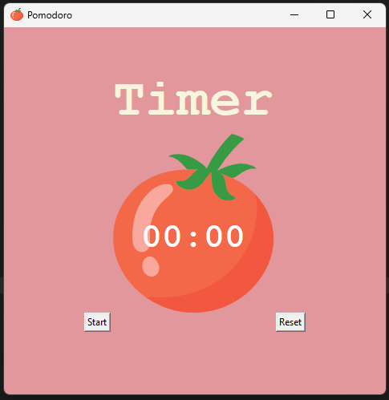

<!DOCTYPE html>
<html lang="en">
<head>
    <meta charset="UTF-8">
    <meta name="viewport" content="width=device-width, initial-scale=1.0">
</head>
<body>

    

        <h1 align="center">CrypticPass</h1>
        
        <a href="" alt="Video showing the Pomodoro Timer app">
    

     
This is a simple Pomodoro timer implemented in Python using the Tkinter library. The Pomodoro Technique is a time management method developed by Francesco Cirillo in the late 1980s. The technique uses a timer to break down work into intervals, traditionally 25 minutes in length, separated by short breaks.

     <h3 align="center">How to Use</h3>
     <ol>
        <li>Clone the repository or download the Python script.
        <li>Make sure you have Python installed on your machine.</li>
        <li>Run the script.</li>
    </ol>
<h3 align="center">Dependencies</h3>
    <ul>
    <li>Python 3.10.11</li>
    <li>Tkinter</li>
    </ul>
<h3 align="center">Features</h3>
    <ul>
    <li>Start Timer: Click the "Start" button to initiate the Pomodoro timer.</li>
    <li>Reset Timer: Click the "Reset" button to stop the timer and reset it to 00:00.</li>
    <li>Session Markings: As you complete each work session, a checkmark ("✓") will be added to indicate completed sessions.</li>
    <li>Work and Break Intervals: The timer alternates between work intervals (30 minutes), short breaks (5 minutes), and a long break (20 minutes after every 8 sessions).</li>
    </ul>
<h3 align="center">Customize</h3>

Feel free to customize the timer intervals by modifying the following constants in the script:

    <ul>
    <li>WORK_MIN: Duration of each work session in seconds.</li>
    <li>SHORT_BREAK_MIN: Duration of each short break in seconds.</li>
    <li>LONG_BREAK_MIN: Duration of the long break in seconds.</li>
    </ul>
<h3 align="center">Acknowledgments</h3>

Tomato image by OpenClipart-Vectors from Pixabay.

<h3 align="center">Contact</h3>

Camille Onoda - <a href="mailto: info@camilleonoda.com">Email</a> - <a href="https://linkedin.com/in/camilleonoda">LinkedIn</a>

(<a href="#readme-top">back to top</a>)

</body>